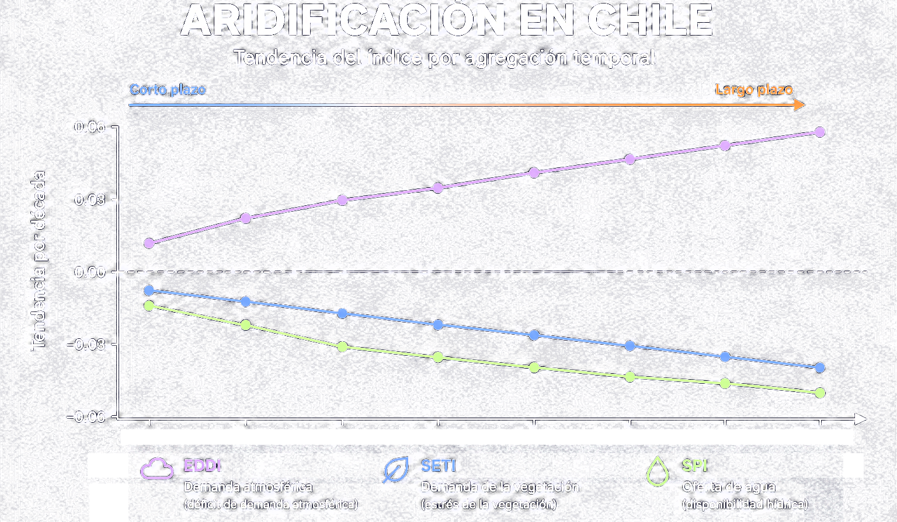
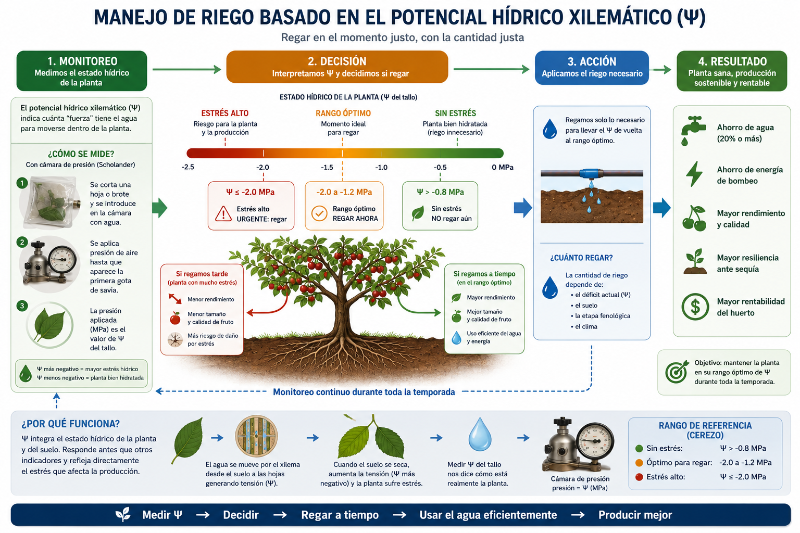

## El Arco de la Investigación {auto-animate="true"}

<div class="timeline-row" data-id="tl-row">
  <div class="timeline-node node-origin" data-id="node-origin"><div class="node-dot" data-id="dot-origin"></div><div class="node-label" data-id="label-origin">Origen</div><div class="node-years">2007–2017</div></div>
  <div class="timeline-node node-present" data-id="node-present"><div class="node-dot" data-id="dot-present"></div><div class="node-label" data-id="label-present">Inmersión</div><div class="node-years">2018–2025</div></div>
  <div class="timeline-node node-future" data-id="node-future"><div class="node-dot" data-id="dot-future"></div><div class="node-label" data-id="label-future">Visión</div><div class="node-years">2026–</div></div>
</div>

<p class="arc-stat">Investigador Responsable de proyectos ANID por <strong>+CLP 1.200 MM</strong> adjudicados</p>

::: {.notes}
Timer: 0:45
:::

## El Desafío de Origen {auto-animate="true"}

<div class="two-col">
<div class="origin-text">

**2007**: Riego deficitario en vides para vino ([tesis de pregrado](https://repositorio.udec.cl/items/bcace9b3-10d2-4f59-bf92-cb8009fef0db)). <span class="lineage-tag">↳ hoy: [SatOri](https://s4tori.cl)</span>

**2013-2015**: Sección sequía informes agrometeorológicos INIA.

**2017**: Sequía agrícola en Chile: de la evaluación a la predicción satelital ([tesis doctoral](https://repositorio.udec.cl/items/2590756f-ee0c-4846-8ae3-f56ee1bb2443)). <span class="lineage-tag">↳ hoy: [ODES-Chile](https://odes-chile.org)</span>

<div class="visit-badges">
  <span class="visit-badge">🇺🇸 National Drought Mitigation Center</span>
  <br></br>
  <span class="visit-badge">🇳🇱 ITC — University of Twente</span>
</div>
<p class="visit-caption">Pasantías doctorales de investigación</p>

<br></br>
**Sequía vs déficit hídrico:**  

* Parecido pero no lo mismo, usualmente confundido.

</div>
<div>
```{python}
#| fig-align: center
#| out-width: 46%
# Ilustración sintética — vacío de datos en clima y rendimiento agrícola
import numpy as np
import matplotlib.pyplot as plt

np.random.seed(11)
bg, teal, orange, gray, white = "#1a1a2e", "#4ecdc4", "#ff6b35", "#b0b0b0", "#ffffff"

fig, (ax1, ax2) = plt.subplots(2, 1, figsize=(3.0, 2.9), facecolor=bg, height_ratios=[1.3, 1])
for ax in (ax1, ax2):
    ax.set_facecolor(bg)
    ax.set_xticks([])
    ax.set_yticks([])
    for spine in ax.spines.values():
        spine.set_visible(False)

# Panel 1 — estaciones climáticas escasas y dispersas
n_points = 26
x = np.random.uniform(0, 1, n_points)
y = np.random.uniform(0, 1, n_points)
active = np.random.choice(n_points, size=6, replace=False)
colors = [orange if i in active else gray for i in range(n_points)]
sizes = [70 if i in active else 42 for i in range(n_points)]
alphas = [0.95 if i in active else 0.45 for i in range(n_points)]
for xi, yi, c, s, a in zip(x, y, colors, sizes, alphas):
    ax1.scatter(xi, yi, color=c, s=s, alpha=a, zorder=3)
ax1.set_xlim(-0.05, 1.05)
ax1.set_ylim(-0.05, 1.05)
ax1.set_title("Estaciones climáticas", color=white, fontsize=7.5, pad=4)

# Panel 2 — registros de rendimiento agrícola incompletos
rows, cols = 4, 9
grid = np.zeros((rows, cols))
filled = np.random.choice(rows * cols, size=6, replace=False)
grid.flat[filled] = 1
for r in range(rows):
    for c in range(cols):
        val = grid[r, c]
        face = teal if val else "none"
        edge = teal if val else gray
        alpha = 0.9 if val else 0.4
        rect = plt.Rectangle((c, rows - r - 1), 0.82, 0.82, facecolor=face,
                              edgecolor=edge, linewidth=1.1, alpha=alpha)
        ax2.add_patch(rect)
ax2.set_xlim(-0.2, cols)
ax2.set_ylim(-0.2, rows)
ax2.set_aspect("equal")
ax2.set_title("Registros de rendimiento agrícola", color=white, fontsize=7.5, pad=4)

plt.tight_layout(h_pad=1.8)
plt.show()
```
<p class="fig-caption-sm">Datos climáticos y de rendimiento: escasos, dispersos e incompletos</p>


<div class="origin-text">
<br><br>

* Dos escalas: nacional (Chile) y local (huerto)
*¿impacto del clima en la agricultura? ¿Qué hacemos?

</div>

<div class="origin-callouts">

</div>
</div>
</div>

<div class="timeline-row timeline-row--mini" data-id="tl-row">
  <div class="timeline-node node-origin is-active" data-id="node-origin"><div class="node-dot" data-id="dot-origin"></div></div>
  <div class="timeline-node node-present" data-id="node-present"><div class="node-dot" data-id="dot-present"></div></div>
  <div class="timeline-node node-future" data-id="node-future"><div class="node-dot" data-id="dot-future"></div></div>
</div>

::: {.notes}
Timer: 1:00
:::

## Primer Marco de Trabajo {auto-animate="true"}

{fig-align='center' width="100%"}

<div class="callout-box">
<strong>Key Insight:</strong> Regresión óptima y deep learning predicen la productividad agrícola con R²=0.95–0.96 un mes antes del fin de temporada — la base de un sistema de alerta temprana.
</div>

<p class="cite-note" style="text-align:center;">Zambrano et al. (2018), *Remote Sensing of Environment* 219, 15–30. <a href="https://doi.org/10.1016/j.rse.2018.10.006">doi.org/10.1016/j.rse.2018.10.006</a></p>

<div class="timeline-row timeline-row--mini" data-id="tl-row">
  <div class="timeline-node node-origin is-active" data-id="node-origin"><div class="node-dot" data-id="dot-origin"></div></div>
  <div class="timeline-node node-present" data-id="node-present"><div class="node-dot" data-id="dot-present"></div></div>
  <div class="timeline-node node-future" data-id="node-future"><div class="node-dot" data-id="dot-future"></div></div>
</div>

::: {.notes}
Timer: 1:00
:::

## La Pregunta Forzada {auto-animate="true"}

<div class="timeline-row" data-id="tl-row">
  <div class="timeline-node node-origin" data-id="node-origin" style="opacity:0.15;"><div class="node-dot" data-id="dot-origin"></div></div>
  <div class="timeline-node node-present is-active" data-id="node-present" style="transform: scale(1.9);"><div class="node-dot" data-id="dot-present"></div><div class="node-label" data-id="label-present">Presente</div></div>
  <div class="timeline-node node-future" data-id="node-future" style="opacity:0.25;"><div class="node-dot" data-id="dot-future"></div></div>
</div>

<div class="arrow-pivot">
<svg viewBox="0 0 100 100" fill="none" xmlns="http://www.w3.org/2000/svg">
  <path d="M20 20 L20 70 L75 70" stroke="#ff6b35" stroke-width="8" stroke-linecap="round" stroke-linejoin="round"/>
  <path d="M60 58 L78 70 L60 82" stroke="#ff6b35" stroke-width="8" stroke-linecap="round" stroke-linejoin="round"/>
</svg>
</div>

<p class="pivot-question">¿Esto es sequía… o ya es aridificación?</p>

::: {.notes}
Timer: 0:30 — la más rápida
:::


## El Resultado Crítico {auto-animate="true"}

{fig-align='center'}

<p class="result-statement">Esto revela que Chile central transita de una sequía cíclica a una aridificación estructural del paisaje — que explica hasta un <strong>78%</strong> de la expansión de matorral y un <strong>40%</strong> del cambio en área forestal.</p>

<p class="cite-note" style="text-align:center;">Zambrano et al. (2025), *Earth's Future* — base científica de ODES-Chile. [https://doi.org/10.1029/2025EF006744](https://doi.org/10.1029/2025EF006744)</p>

<div class="timeline-row timeline-row--mini" data-id="tl-row">
  <div class="timeline-node node-origin" data-id="node-origin"><div class="node-dot" data-id="dot-origin"></div></div>
  <div class="timeline-node node-present is-active" data-id="node-present"><div class="node-dot" data-id="dot-present"></div></div>
  <div class="timeline-node node-future" data-id="node-future"><div class="node-dot" data-id="dot-future"></div></div>
</div>

::: {.notes}
Timer: 1:15 — clímax
:::

## Adaptación {auto-animate="true"}

{fig-align='center'}

<p class="cite-note" style="text-align:center;">Zambrano et al. (2025), *Agricultural Water Management* 318, 109721 — base científica de SatOri.<a href="https://doi.org/10.1016/j.agwat.2025.109721">https://doi.org/10.1016/j.agwat.2025.109721</a></p>

<div class="timeline-row timeline-row--mini" data-id="tl-row">
  <div class="timeline-node node-origin" data-id="node-origin"><div class="node-dot" data-id="dot-origin"></div></div>
  <div class="timeline-node node-present is-active" data-id="node-present"><div class="node-dot" data-id="dot-present"></div></div>
  <div class="timeline-node node-future" data-id="node-future"><div class="node-dot" data-id="dot-future"></div></div>
</div>

::: {.notes}
Timer: 1:15
:::

## Conectando los Puntos {auto-animate="true"}

<div class="venn-wrap">
  <div class="venn-circle venn-past"></div>
  <div class="venn-circle venn-present"></div>
  <div class="venn-label venn-label-past">Teledetección + estadística espacio-temporal + sequía<span class="venn-sublabel">+ aridificación</span></div>
  <div class="venn-label venn-label-present">Machine Learning + sistemas operacionales de monitoreo hídrico<span class="venn-sublabel">+ inferencia causal y socio-hidrología</span></div>
  <div class="venn-label venn-label-overlap">Ciencia predictiva y accionable para la adaptación agrícola</div>
</div>

<p class="arc-stat" style="margin-top: 0.8em;">Hoy, ambos orígenes operan como sistemas de decisión en producción:</p>
<div style="text-align: center;">
<ul class="arc-stat-list">
  <li><strong><a href="https://odes-chile.org/">ODES-Chile (https://odes-chile.org/)</a></strong></li>
  <li><strong><a href="https://s4tori.cl/">SatOri (https://s4tori.cl/)</a></strong></li>
</ul>
</div>

<div class="timeline-row timeline-row--mini" data-id="tl-row">
  <div class="timeline-node node-origin is-active" data-id="node-origin"><div class="node-dot" data-id="dot-origin"></div></div>
  <div class="timeline-node node-present is-active" data-id="node-present"><div class="node-dot" data-id="dot-present"></div></div>
  <div class="timeline-node node-future" data-id="node-future"><div class="node-dot" data-id="dot-future"></div></div>
</div>

::: {.notes}
Timer: 1:00
:::

## Direcciones Futuras {auto-animate="true"}

Financiamiento y publicaciones en curso (2026-)

<div class="two-col futures-col">
<div>

<p class="futures-heading">Financiamiento</p>

::: {.stacked-box .fragment}
<span class="aim-label">Adjudicado</span> **Anillos ACT** (CLP 660 MM) — cuenca del Aconcagua.
:::

::: {.stacked-box .fragment}
<span class="aim-label">En evaluación</span> **FONDECYT Regular** (CLP 220 MM) <span class="lineage-tag">↳ extiende ODES-Chile</span>
:::

::: {.stacked-box .fragment}
<span class="aim-label">En evaluación</span>
<strong>FIA — ΨSat</strong>
<span class="lineage-tag">↳ extiende SatOri</span>
:::

</div>
<div>

<p class="futures-heading">Publicaciones en revisión</p>

::: {.stacked-box .pub-box .fragment}
<span class="aim-label pub-label">En revisión</span> **Journal of Hydrology** — eficiencia hídrica bajo aridificación. <span class="lineage-tag">↳ extiende ODES-Chile</span>
:::

::: {.stacked-box .pub-box .fragment}
<span class="aim-label pub-label">En consideración</span> **Nature Water** — embalses y vulnerabilidad a la megasequía. <span class="lineage-tag">↳ extiende ODES-Chile</span>
:::

::: {.stacked-box .pub-box .fragment}
<span class="aim-label pub-label">En revisión</span> **IEEE Geoscience and Remote Sensing Letters** — fusión multi-sensor para estimación de biomasa aérea en trigo. <span class="lineage-tag">↳ extiende ODES-Chile</span>
:::

</div>
</div>

<div class="timeline-row timeline-row--mini" data-id="tl-row">
  <div class="timeline-node node-origin" data-id="node-origin"><div class="node-dot" data-id="dot-origin"></div></div>
  <div class="timeline-node node-present" data-id="node-present"><div class="node-dot" data-id="dot-present"></div></div>
  <div class="timeline-node node-future is-active" data-id="node-future"><div class="node-dot" data-id="dot-future"></div></div>
</div>

::: {.notes}
Timer: 1:00
:::

## Gracias {auto-animate="true" background-color="#1a1a2e" .hero-slide}

<p class="so-what">Mi objetivo es transformar datos satelitales en decisiones que ayuden a Chile a adaptarse a un futuro más seco.</p>

<div class="social-links">
  <a href="https://francisco-zambrano.cl" class="social-link"> Web</a>
  <a href="https://scholar.google.com/citations?user=mKQRdOEAAAAJ&hl=es" class="social-link"> Google Scholar</a>
  <a href="https://orcid.org/0000-0001-6896-8534" class="social-link"> ORCID</a>
  <a href="https://www.linkedin.com/in/frzambra" class="social-link"> LinkedIn</a>
  <a href="https://github.com/frzambra" class="social-link"> GitHub</a>
</div>

<p class="ack-line">Universidad de Concepción · ITC — Universidad de Twente · CALMIT / NDMC · Centro Hemera — Universidad Mayor · Universidad de Las Américas · ANID</p>

::: {.notes}
Timer: 0:30
:::
